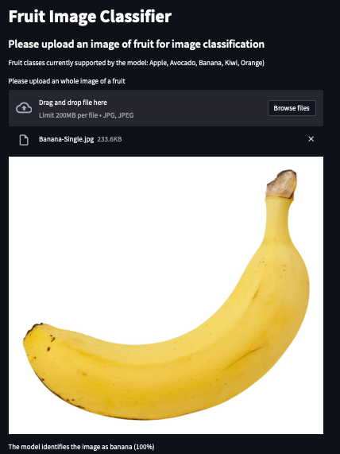

# Fruit Image Classifier
## A simple web-app for fruit image classification.

This simple web-app identifies and classifies a digital image of a fruit amongst six fruit categories: Apple, Avocado, Banana, Kiwi, Orange.
The app uses a trained CNN model, as its prediction engine, which has a classification accuracy of 92% on the test dataset.

## Structure of the repository

```
|-- Model                             # contains the trained CNN model
|-- app_interface
|-- python - code
|   |-- archive models                # cotains old python code files for training CNN
|   |-- cnn_tuned_architecture.py     # final code used for training the model
|   app.py                            # streamlit app
|-- data.zip                          # fruit classification data set in zip format
|-- requirements.txt                  # list of dependencies and version numbers
|-- utility_functions.py              # Some functions used by the streamlit app
```

## Data

The data is in zip format. 
Source: The image dataset has been mainly sourced from an online source.
When unzipped, the structure of the data folder is as following:

```
|-- data
|   |-- test
|       |-- apple
|       |-- avocado
|       |-- banana
|       |-- kiwi
|       |-- organge
|   |-- training
|       |-- apple
|       |-- avocado
|       |-- banana
|       |-- kiwi
|       |-- organge
|   |-- validation
|       |-- apple
|       |-- avocado
|       |-- banana
|       |-- kiwi
|       |-- organge
```

## Usage:

(Before using the app, make sure you have all the depencies installed as listed in the requirements.txt)

- Pull the repository to local drive
- In the terminal/command prompt, navigate to the directory containing app.py
- Type in the command: 
```
streamlit run app.py
```

## Model performance
The model has been trained on limited dataset which contains clean 'studio-type' images of the five fruit classes with clear background. The validation and test datasets also correspond to the training dataset. As such, the model is able to achieve 98% accuracy on the test set.

The fruit classifier app, however, is unable to achieve 98% accuracy on any images of the fruit having rich background. In future, I intend to collect further images dataset, of the five fruit classes, and re-train the model to increase its classification accuracy on fruit images with diverse backgrounds.

## Streamlit User Interface


